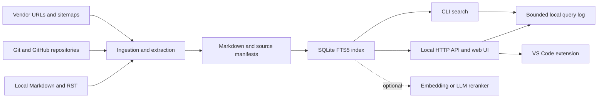

# Architecture and data flow

docs-puller separates source ingestion, local storage, retrieval, and optional
external reranking.

The Markdown corpus, manifests, FTS5 index, and query log stay under the selected
`--out` directory. The open-source CLI does not use the proprietary hosted Team
service in this data flow.

Network pulls read vendor or repository content. Local BM25 search does not send
a query to an external provider. Optional embedding and LLM rerank modes can
send content to the configured provider.

The CLI and local HTTP server use the same search pipeline. The VS Code
extension is a thin client for the HTTP API. Release consumers can inspect the
command and capability contract with `docs-puller version --json`.
